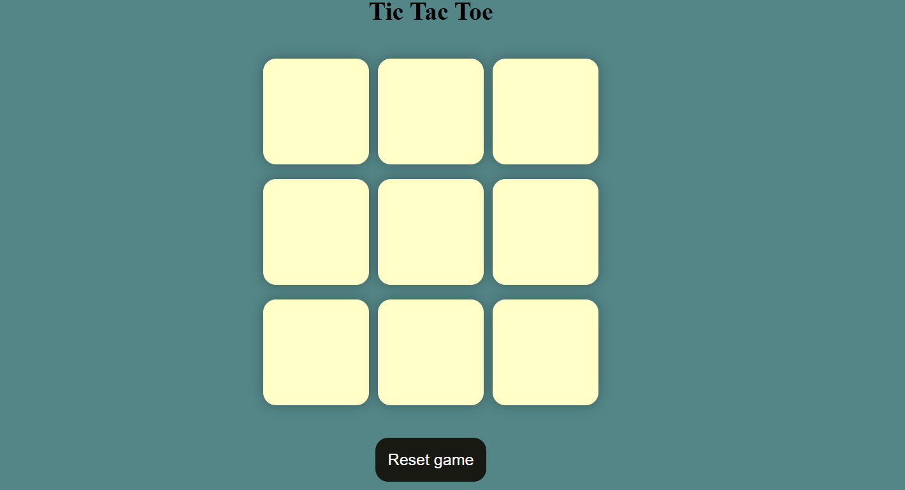
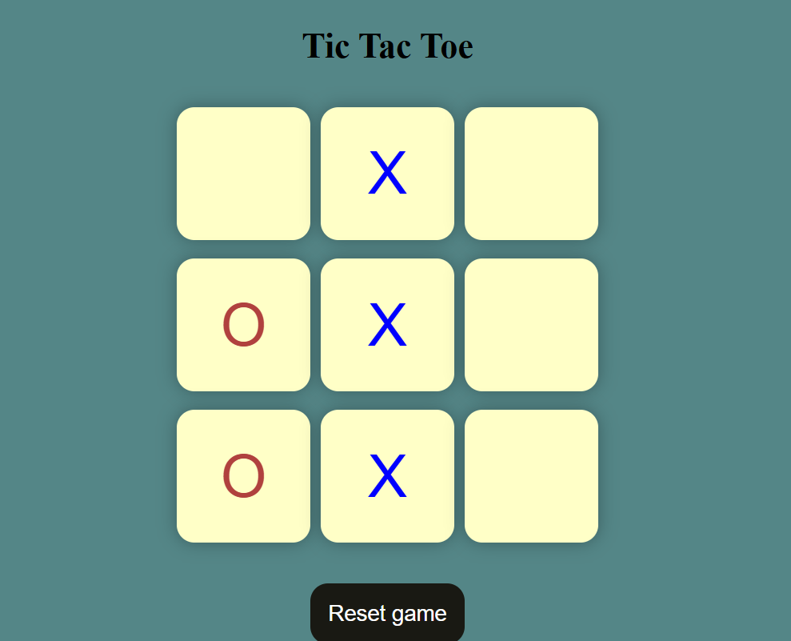

# 🎮 Tic Tac Toe Game

A simple and responsive 2-player **Tic Tac Toe** game built with **HTML**, **CSS**, and **JavaScript**. The game allows two players to take alternate turns marking X or O, with automatic win detection and a friendly UI.

---

## ✨ Features

- 🎨 Clean and modern design
- 🔁 Real-time turn switching between X and O
- 🏆 Displays winner with message screen
- 😐 Draw match detection
- 🚫 Disables grid after game ends
- 🔄 Reset and New Game options
- 📱 Responsive layout for desktop and mobile

---

## 📸 Screenshots

### 🧩 Game Board  


### 🎉 Winner Message  


### ❌ X Wins Example  


---

## 🚀 How to Run

1. Clone or download this repository:
   ```bash
   git clone https://github.com/Chathan-kamathalli/TicTacToeGAME.git
   cd TicTacToeGAME
